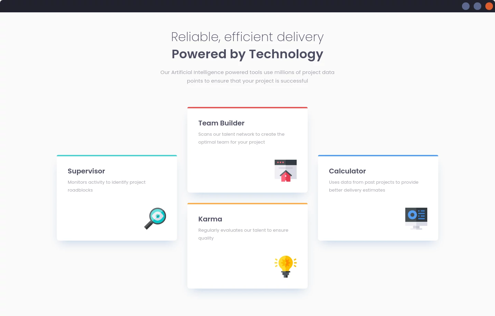

# Frontend Mentor - Four card feature section

This is a solution to the [Four card feature section challenge on Frontend Mentor](https://www.frontendmentor.io/challenges/four-card-feature-section-weK1eFYK).

## Live Version
> [GitHubPages](https://michal-majchrzak.github.io/fm-four-card-feature-section/)

## Screenshot
### Mobile

Uicons by [Flaticon](https://www.flaticon.com/uicons)
### Desktop

## Built with

- HTML5 markup
- CSS & Sass
- Responsive layout
- Mobile-first workflow

## Author

- Frontend Mentor - [@Michal-Majchrzak](https://www.frontendmentor.io/profile/Michal-Majchrzak)